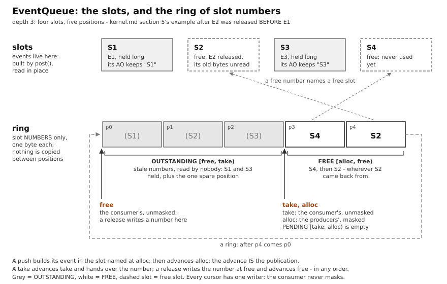

# The active-object kernel

Headers: `brio/kernel/`. Everything in this stratum is pure
logic, templated on a `Platform` and never on a specific machine -
host-testable, no target includes; the reference index at the end
maps every entity to its header. Where a concrete number appears
below it is a worked example from one platform, marked as such, never
an assumption of the kernel.

How to read this: sections 1-2 give the model and the contract; 3-10
follow the life of an event (born, carried, queued, dispatched,
delivered, scheduled, timed, lost); 11 is what the machine must
provide; 12 is the index.
Paragraphs marked **C++ note** explain the C++17/20/23 idiom the code
relies on - brio is deliberately written in modern C++ and those
idioms are part of the design, not decoration.

## 1. The model in one page

An **active object** (AO) is a piece of logic that owns a queue of
events and reacts to them one at a time. It never blocks, never
waits, never polls: it is *given* an event by the kernel, runs a
short piece of code to completion (**run-to-completion**, RTC),
possibly posts events to other AOs, arms a timer, or changes state,
and returns. Between two dispatches it holds no stack: all its data
is static.

The **kernel** is a cooperative loop on the single main stack. Each
turn it fires matured time events, then serves ONE event from the
highest-priority non-empty queue, then starts again from the top. If
every queue is empty it sleeps until an interrupt. There is no
preemption between AOs: while one dispatch runs, no other AO runs.
The only concurrency in the system is **ISR versus main loop**, and
ISRs are allowed to do exactly one kernel thing: `post()` an event
(a few bytes copied inside a brief critical section).

That is the whole concurrency model, and its other half is stated as
plainly: **an ISR body runs to completion too - no interrupt nests
over another.** There are two contexts, one boundary between them,
and one primitive that guards it. Every service that an ISR touches
is built for exactly that boundary and no other: `EventQueue` masks
interrupts around the one copy a post makes, `MeterLatch` and `Trace`
around their
one index, `Ring` is single-producer/single-consumer because one side
is an ISR and the other the loop. An interrupt that could preempt an
interrupt would be a third kind of context, and every driver whose
two vectors share a state machine would become a design question -
for a latency that brio buys with short bodies and DMA instead, means
the smallest core has. Nothing that needed nesting would run on the
AVR, so nothing in brio may need it.

This is the "QV" flavor of active objects (cooperative, one stack,
priority by scan order) described in Samek's book, written from
scratch (clean room: concepts only, never the QP source).

**A chip with two cores runs two of these kernels, not one on two
cores.** Every guarantee above is a statement about ONE core's loop,
so a second core adds exactly one more boundary - core against core -
and the model closes it as it closed the first: a fixed set of
bridges, one primitive per boundary, and no AO ever sees either.
Section 12 states it; `util/inbox.hpp` is the bridge.

Everything is a **monostate**: AOs, drivers, queues' owners, the
kernel itself are classes with no instances and only static members,
selected by type. Priority, wiring and subscriptions are types and
template parameters, resolved at compile time. Nothing is looked up
at run time; the RAM footprint is exactly the sum of what is
declared.

**C++ note - monostate and `static inline`.** A monostate class is
one where every data member is `static inline` (C++17): the variable
is defined in the header, once per program, with no .cpp file and no
initialization-order problem. `Fsm() = delete;` on the constructor
makes "no instances" explicit. Choosing a monostate by *type* is what
lets `Tenuto<P, Traffic, Buttons>` visit the AOs with a fold
expression instead of walking a table of pointers at run time.

## 2. The AO contract (`kernel/active_object.hpp`)

The kernel does not derive AOs from a base class (a virtual base would
force a system-wide event type and cost an indirect call per event).
It states what it needs as a **concept**, `ActiveObject`:

- a nested type `Event` - the AO's own event variant;
- a static member `queue` (an `EventQueue`) whose `take()` hands over a
  slot's NUMBER - the oldest waiting event's, or `none` - whose `at()`
  yields the `const Event&` in that slot, whose `take_hold()` says
  whether the AO held the slot it was just dispatched from, whose
  `release()` takes a number back, and whose `empty()` yields `bool`;
- static `init()` - called once by `Tenuto::init_all()` in pack order,
  before the first event is served; an Fsm-based AO calls
  `start(&initial)` here;
- static `dispatch(const Event&)` - run ONE event to completion.

That is the **formal half**: names, signatures, return types, checked
by the compiler where an AO enters `Tenuto<...>`. The **informal
half** is the set of rules the compiler cannot see and that the
kernel is written assuming: dispatch is RTC and is only ever called
from the loop, interrupts enabled, never re-entered; the AO's static
data therefore needs no locking against other AOs (only ISRs are
concurrent, and they touch nothing but the queue, through `post()`);
the event a dispatch receives stays in its queue slot, and the slot is
the consumer's until it is RELEASED - by the loop right after the
dispatch, unless the AO called the queue's `hold()` inside it, in which
case by the AO itself, in a later dispatch of its own (section 4's
third lease); a held slot is released once and by its owner; `init()`
must leave the AO in a real state; the queue is really an
`EventQueue`. Wherever this document says "contract" it means both
halves.

An ordinary AO sees none of this: `dispatch` keeps its signature, the
loop releases what nobody held, and an AO that never calls `hold()`
changes not one line. One that holds (the bus arbiter,
[spi-bus.md](spi-bus.md)) keeps the `Held<Event>` that `hold()` returned,
reads the event with `queue.at()` whenever it needs it, and calls
`queue.release()` when it is done. Such an AO is served through its
slot - by the loop, or by `serve_one<Ao>()` where a program pumps it by
hand - and never by dispatching the copy `pop()` returns, which has no
slot to hold: a `hold()` there would hand out the number of the slot
`pop()` had already released. Like the rest of this half, the rule is
stated and not checked.

`Fsm<Derived, Alts...>` (section 5) is *one way* to satisfy the
contract - it gives you `Event` and `dispatch` - not the contract
itself. An AO with a hand-written variant and a switch is a legal
citizen. That is why `active_object.hpp` includes nothing of
`fsm.hpp`, and why the `queue` member is always declared by the AO
itself: its depth is that AO's sizing decision.

**C++ note - concepts and `requires`.** A `concept` (C++20) is a
named compile-time predicate on types. `ActiveObject<Buttons>` is
just `true` or `false`; nothing happens until a template *applies*
it: `template <Platform P, ActiveObject... Aos> class Tenuto` (the
short form: the concept name replaces `typename`), or a trailing
`requires ActiveObject<Ao>` clause, or a `static_assert`. When a
constrained template is instantiated with a type that fails, the
error names the concept and the requirement that failed - which is
the whole point over "duck typing" by plain templates, where the
error would be an unreadable failure deep inside the body. In brio
the concepts ARE the contracts between strata: `ActiveObject` and
`Platform` here, `ByteSink`/`ByteSource` for the drivers.

## 3. Events: value semantics, per-AO variant

An event is a small, trivially copyable struct - `struct Tick {}`,
`struct Pressed { uint8_t which; }`, `struct TempChanged { int16_t
c10; }`. Each AO declares its own **event type** as a `std::variant`
of the structs it accepts (`Fsm` builds it for you: `Event =
std::variant<Entry, Exit, Alts...>`). There is no global signal enum
and no system-wide event type: plain shared structs are the lingua
franca between publishers and subscribers, and two AOs that accept
the same struct simply both list it in their variant.

Events are **copied** into per-AO queues - no pools, no reference
counting, no shared ownership - and copied ONCE: `post()` builds the
event in its slot and the kernel dispatches it from there, with no
temporary on the way in and no copy on the way out (section 5). The
8-byte size target is a **guideline** for the event envelope, not a
law: every slot of a queue pays that AO's largest alternative, and the
push copies it with interrupts masked (on an 8-bit core at 24 MHz,
~1 us per 8 bytes). Per-AO deviations are legal with numbers in hand, and nobody
else pays for them (the queues are per-AO). Measured on one platform
(avr-gcc 16.2, -Os): `std::visit` on a 4-alternative variant compiles
to a plain switch, +30 bytes flash and identical RAM vs a hand-tagged
union.

Two alternatives are reserved and always first: `Entry` and `Exit`
(empty structs, so they do not enlarge the slots). They are
delivered synchronously by the state-machine machinery and are never
posted; `post()` refuses them at compile time.

**C++ note - `std::variant`, `std::visit`, `match`.**
`std::variant<A, B, C>` (C++17) is a type-safe tagged union: it holds
exactly one of A, B or C and remembers which. Its size is the largest
alternative plus one index byte - which is why the queue slot size is
"the AO's largest alternative". `std::visit(f, v)` calls `f` with
the alternative currently held; `f` must therefore be callable with
*every* alternative. Handlers in brio write

    return brio::match(e,
          { return transition(&green); },
         { lamp_red(); return handled(); },
          { return unhandled(); });

subject first, then one lambda per case, a `` catch-all for
the rest (variant dispatch is exhaustive: without it the code does
not compile) - the shape of `match` in Rust/ML and of the pattern
matching proposed for C++ (P2688, not adopted for C++26; `match` here
is a four-line library stand-in in `kernel/fsm.hpp`).
Underneath sits the classic C++17 building block, public as
`brio::Overloaded`:

    template <class... Ts> struct Overloaded : Ts... {
        using Ts::operator()...;
    };

it inherits from all the lambdas and pulls all their `operator()`
into one overload set, so `std::visit(Overloaded{...}, e)` dispatches
by overload resolution at compile time (class template argument
deduction + pack expansion of using-declarations). `match` forwards
to exactly that and compiles to the same switch (measured on two
bench apps: flash identical to spelling out the `std::visit` +
`Overloaded` dispatch by hand). `std::variant` needs its alternatives to
be complete types and, for the queue, trivially copyable -
`EventQueue` static-asserts this: an event may be copied by an ISR,
byte-wise, and no destructor will ever run for it.

## 4. Payloads: what travels inside the event (`kernel/borrowed.hpp`)

The event envelope is copied, so what the struct *contains* decides
the cost - and, for pointers, the rules. The whole payload rule fits
in three lines:

1. **Copy what is read once** - descriptors, commands, results,
   facts: by value. Size is a per-AO budget (section 3); deviations
   are legal with numbers in hand.
2. **Borrow only what must be shared** - storage that hardware or a
   producer writes into and that would be absurd to copy: by
   reference, and every borrow is one of exactly two leases:
   - `Lease::dispatch` - valid during the receiving dispatch only;
     correct by construction when the borrower PRECEDES the lender in
     the Tenuto pack;
   - `Lease::reply` - valid until the borrower posts the agreed
     completion event; the reply IS the return of the loan.
3. **Published payloads travel by value** (or by const reference at
   most): N subscribers see the same struct in N sequential dispatches,
   a mutable loan would let each modify what the next one sees.

The case-by-case then reduces to one question per field: is this data
*read once by one receiver*, or *written by someone else while it is
in flight*? The first has one answer, the second has two.

**Why the distinction is safe under this kernel.** There is no
concurrency between AOs, so two AOs can never write the same buffer at
the same time; the only hazard of a loan is *aliasing in time* - the
lender reusing storage the borrower still holds. Both leases pin that
down: for `dispatch` the pack order guarantees the borrower runs
before the lender is dispatched again (and under a preemptive kernel
the same order makes the borrower preempt the lender right at the
post - the rule survives QK unchanged); for `reply` the boundaries are
two explicit events. At every instant exactly one party has the right
to write: ownership moves, it is never shared.

**How it is written down.** `Borrowed<T, Lease>` is a plain pointer
with the lease in its type: zero cost, trivially copyable, and the
contract becomes readable at the field (`struct LineReceived {
Borrowed<char, Lease::dispatch> line; }`). The lender of a `dispatch`
loan declares its borrowers - `using LendsTo = Subscribers<Sink>;` -
and `Tenuto` static_asserts that each precedes it in the pack: the
scheduling contract of the serial stack is a compile-time fact, not a
comment. What C++ cannot do is stop a receiver from stashing the raw
pointer past its window; the planned debug-build addition is a lender
epoch inside `Borrowed` compared on access (stale loan -> panic on the
guilty instruction), built when a host test simulating preemption
needs it. `lend<Lease::reply>(buf)` is the maker that names a loan at
the call site, spelled like `reply_to<Ao, Payload>()` - the lease is
the explicit argument, the pointee type is deduced; a field left out
(or `{}`) is a null loan. Bus tx/rx/command buffers and the source
bytes of a nonvolatile write are `reply` loans and say so in their
field types; the engine that walks such a buffer calls `.get()` and
indexes the raw pointer, because a loan is a view and not a container.

**The third lease: a held slot.** The two leases above are for what an
event CARRIES. The event itself lives in a slot of its receiver's queue
(section 5), and the receiver may keep that slot past the dispatch:
`Lease::hold`, valid from the AO's `hold()` until the SAME AO's
`release()` of it, which it issues in a later dispatch of its own. The
lender is the AO's own queue and the borrower the AO, so the rule is
one sentence: **a held slot is released by its owner, and by nobody
else** - another AO releasing it would be a second consumer of the
queue, and the consumer side's freedom from masks rests on there being
one. `Held<E>` is the handle with the lease in its type: the slot's
number, one byte, null by default (it pins the event type, not the
owner: the rule above is what keeps the owner). A holder that lends
onward from the slot for as long as it holds it - a request an engine
would read across a whole transfer - would do it as a
`Borrowed<..., Lease::hold>`; no engine does today, each keeping its
own copy of the request, a choice each family's bus round revisits. The loop's
`const Event&` is not a lease at all: it is the event's own lifetime,
which for an event nobody holds ends with its dispatch. Like the other
two, the lease names the rule at the point of use and does not enforce
it; the debug epoch planned for `Borrowed` is the same mechanism one
level down.

**In use today.** `LineReceived` lends the line buffer for one
dispatch (mutable: in-place tokenization is the point). Bus requests
travel by value - the request IS the arbitration token: a few tens of
bytes of addresses, lengths and the select, copied once into the bus
queue by `post()` and once more by the engine that keeps it, the
arbiter HOLDING the slot while the request waits and while it is on
the wire and reading it there ([spi-bus.md](spi-bus.md)'s copy
accounting) - and lend the data buffers until `BusDone` - the borrowed
surface is the structurally necessary minimum. Nothing is ever
chopped into several events: one event = one envelope, the cargo
stays put.

**Fan-out cost.** `publish()` is one `post()` per subscriber: N
subscribers = N copies of the envelope, in N queues, one critical
section each. Fine for small notifications; a large published payload
would be N times wrong, which is why "facts" are small structs.
**Replies** (section 7) are ordinary posted events too: the service
copies the small result struct into the requester's queue.

**One more discipline, stated for the future.** AOs share nothing but
events: an AO's own statics are safe because its dispatch is never
re-entered, but a global touched by two AOs outside events is safe
only because this kernel is cooperative - under a preemptive one it is
a one-way race. The rule costs nothing today and keeps the QK door
open.

## 5. Queues (`kernel/event_queue.hpp`)

One `EventQueue<E, depth, Platform>` per AO, **multi-producer** (any
ISR, any main-loop code, any timer) **single-consumer** (the AO's
dispatch context: the loop, and the AO itself when it holds a slot). The
kernel assumes no atomic read-modify-write from the machine (the
smallest candidate cores have none), so the honest primitive for the
PRODUCERS is a brief interrupts-off section - the platform's
`CriticalSection` - and the CONSUMER takes no mask at all. There are
deliberately no `*_from_isr` twins: one always-safe API.

[open the diagram full size](https://raw.githubusercontent.com/uliano/brio/main/docs/design/event-queue.svg)

### Two things kept apart: the slots and the ring

A queue is two arrays, and the whole design is in keeping them apart.

- The **slots**, `depth + 1` of them, each the size of the AO's
  `Event`. `post()` BUILDS an event in a slot - a variant's alternative
  emplaced there, under the mask: the one copy a post makes - and the
  event STAYS in that slot, read in place by its dispatch, until the
  slot is **released**: by the loop right after the dispatch, or later
  by the AO when it held it (section 4's `Lease::hold`).
- The **ring**, `depth + 2` positions of one byte each, holding slot
  NUMBERS - `S1`, `S2` ... below - and nothing else. Nothing in the
  ring is an event, and nothing is ever copied from one position to
  another: what moves is three cursors, and what is written is one byte
  at a time.

### Three runs, three cursors

The cursors cut the ring, in ring order, into three runs:

| run | from | to | its positions hold |
|---|---|---|---|
| PENDING | `take` | `alloc` | the numbers of built events, oldest first |
| FREE | `alloc` | `free` | the numbers of empty slots, in the order the producers will use them |
| OUTSTANDING | `free` | `take` | nothing anyone reads: the positions of slots taken and not yet released |

- `alloc` is the PRODUCERS' cursor, written only under the mask. A push
  reads the number at `alloc`, builds the event in that slot and
  advances `alloc`: the advance moves the number from the free run into
  the pending run, and IS the publication. Allocation order is push
  order, so the free run doubles as the order of the pending one - one
  ring, not two.
- `take` and `free` are the CONSUMER's, written without a mask. A take
  reads the number at `take` and advances it: the slot is now
  outstanding and its event is dispatched where it lies. A release
  writes the slot's number at `free` and advances `free` - whichever
  slot it is, in whatever order the slots come back.
- The ring has ONE POSITION MORE than there are slots. The outstanding
  run therefore always keeps a spare position while anything is
  outstanding, and each test reads one pair of cursors: the pending run
  is empty when `take` meets `alloc`, the free run when `alloc` meets
  `free`. No count is shared between the two sides.

### The example, step by step

Four slots (`depth` 3), numbered 1 to 4 - S1 to S4 - so five positions
`p0` to `p4`. In the tables a number in parentheses is STALE - left behind in the outstanding run and
read by nobody - and a dash is a position never written.

**Start.** Every slot free, the spare position at the end.

| | p0 | p1 | p2 | p3 | p4 |
|---|---|---|---|---|---|
| number | S1 | S2 | S3 | S4 | - |
| run | free | free | free | free | outstanding |
| cursors | take, alloc | | | | free |

**E1 arrives and is held long.** A producer finds S1 at `alloc` (p0),
builds E1 in S1 and advances `alloc` to p1. The loop takes it - `take`
to p1 - dispatches E1 in S1, and the AO holds it: from now on the AO
keeps the number S1, which never moves.

| | p0 | p1 | p2 | p3 | p4 |
|---|---|---|---|---|---|
| number | (S1) | S2 | S3 | S4 | - |
| run | outstanding | free | free | free | outstanding |
| cursors | | take, alloc | | | free |

S1 = E1, held.

**E2 arrives, held medium.** S2 from p1; `alloc` and `take` to p2.

| | p0 | p1 | p2 | p3 | p4 |
|---|---|---|---|---|---|
| number | (S1) | (S2) | S3 | S4 | - |
| run | outstanding | outstanding | free | free | outstanding |
| cursors | | | take, alloc | | free |

S1 = E1 held, S2 = E2 held.

**E3 arrives, held long.** S3 from p2; `alloc` and `take` to p3. One
free slot is left, S4.

| | p0 | p1 | p2 | p3 | p4 |
|---|---|---|---|---|---|
| number | (S1) | (S2) | (S3) | S4 | - |
| run | outstanding | outstanding | outstanding | free | outstanding |
| cursors | | | | take, alloc | free |

S1 = E1 held, S2 = E2 held, S3 = E3 held.

**E2 finishes BEFORE E1.** Its holder releases S2: the number is
written at `free` (p4) and `free` moves on, wrapping to p0. The old S2
at p1 stays behind as a stale number in the outstanding run, read by
nobody; S1's position is not touched, and that S1 is older does not
matter - a release goes to the end of the free run whatever its order.
This is the state the diagram draws.

| | p0 | p1 | p2 | p3 | p4 |
|---|---|---|---|---|---|
| number | (S1) | (S2) | (S3) | S4 | S2 |
| run | outstanding | outstanding | outstanding | free | free |
| cursors | free | | | take, alloc | |

S1 = E1 held, S3 = E3 held, S2 and S4 free.

**E4 arrives, is fast, and is released at once.** The producer finds S4
at p3 and advances `alloc` to p4; the loop takes it (`take` to p4),
dispatches it, the AO does not hold it, and the loop releases S4: the
number is written at `free` (p0), `free` to p1.

| | p0 | p1 | p2 | p3 | p4 |
|---|---|---|---|---|---|
| number | S4 | (S2) | (S3) | (S4) | S2 |
| run | free | outstanding | outstanding | outstanding | free |
| cursors | | free | | | take, alloc |

**E5 arrives and takes S2 - while S1 and S3 are still held.** The
producer finds S2 at p4, builds E5 in it and advances `alloc`, wrapping
to p0. Until the loop takes it, all three runs are on the ring at once.

| | p0 | p1 | p2 | p3 | p4 |
|---|---|---|---|---|---|
| number | S4 | (S2) | (S3) | (S4) | S2 |
| run | free | outstanding | outstanding | outstanding | pending |
| cursors | alloc | free | | | take |

**Then E5 is served and released, and E1 and E3 finish, in any order.**
Each release writes one number at `free`: S2 at p1, then - say - S1 at
p2 and S3 at p3, `free` ending at p4. The free run is p0 to p3 again,
the spare position is p4 again, and the slots come out in a new order
- S4, S2, S1, S3 - which nothing cares about.

| | p0 | p1 | p2 | p3 | p4 |
|---|---|---|---|---|---|
| number | S4 | S2 | S1 | S3 | (S2) |
| run | free | free | free | free | outstanding |
| cursors | take, alloc | | | | free |

### The questions a reader asks

**Is anything copied?** One event, once: by `post()`, into its slot.
After that every operation writes one byte - a cursor, or a slot number
at `free` on a release. A held event is never moved, however long it
is held and however many events pass beside it.

**Does anybody point into the ring?** No. A holder keeps the SLOT's
number (a `Held<E>`, section 4), which is fixed from `post()` to
release; positions are the queue's own bookkeeping, and they can move
under nobody's feet because nobody outside the queue knows them.
`take()` returns the number and `at()` the event in that slot.

**What if a slot is released twice?** Nothing checks it, and the queue
is corrupted for good: the second release writes a number the free run
already holds, so the queue reads full for ever (every push refused,
`size()` zero, `overflows()` climbing) or hands one slot to two
producers. One holder, one release - the lease's rule (section 4) is
what keeps it.

**Why does the consumer never mask?** Every cursor has ONE writer:
`alloc` the producers (serialized among themselves by the mask), `take`
and `free` the consumer. A producer reads only the free run, which the
consumer filled before it moved `free`; the consumer reads only the
pending run, whose positions nobody has touched since a producer read
them; the consumer writes only the outstanding run, which no producer
reads. A cursor is one byte, one access on every platform
(`atomic_width`), and between a slot or a position and the cursor that
publishes it sits a compiler fence - `std::atomic_signal_fence`, `Ring`'s
idiom, correct because the queue belongs to one core (below). An empty
queue costs the consumer two loads and a compare.

**Why is a static queue still in `.bss`?** Every kernel static is all
zero at boot and costs neither flash nor a copy at startup - the queue
too, whenever its event's value-initialised state is all zero, as every
`Fsm` event's is (`Entry`, the first alternative, carries nothing); an
event type with non-zero defaults makes it a `.data` image - and the
ring's natural first state - the slots' numbers in order, `free` at the
end of them - is not zero. Three choices make it zero, and they cost the
producers' masked window one XOR. `free` is stored as the position after
it, the FENCE, zero at the start: the producer computes the position
after `alloc` anyway to publish, and the queue is full when THAT meets
the fence - the same test. Each position is kept one place ahead in the
array, so the place a release writes IS the fence and the place a take
reads is the next position it computes anyway - no step back anywhere.
And each number is stored XOR its place in the array, with the slots
numbered from 1: the first state, number i at place i, reads zero, and
the spare position reads 0, the `none` an empty `take()` returns.
Without them the whole queue, slots included, would be an initialised
object in flash, copied at every boot.

**How big must a queue be?** A COUNT, not a time. `depth` is the number
of events that can be waiting OR HELD at once while a dispatch is in
progress: the queue holds `depth + 1` slots, the extra one for the event
being dispatched, so a post from inside a dispatch - an AO posting to
itself - finds `depth` places like a post from anywhere else. The
overflow moment, in one rule: **a push is refused when every slot is
occupied, waiting or outstanding** (being dispatched, or held). With
nothing being dispatched and nothing held the spare slot takes a waiting
event too, so an idle queue accepts `depth + 1`; each hold takes one of
the `depth` for as long as it lasts. An AO therefore sizes its depth as
the events it holds at once plus its waiting peak - never from how long
a hold lasts: a hold costs exactly its own slot for any duration, and
whether something held ever ends (a transfer that never answers) is
liveness, which belongs to the holder (a bus's timeout), not to the
queue. `capacity()` answers `depth`, `size()` the events waiting. Depth
may be any number up to 254 - the slot numbers 1 to `depth + 1` are
bytes, and 0 is the `none` an empty `take()` returns - with no
power-of-two rounding, which would waste real RAM to speed up a wrap
that is already two instructions.

### Why not the obvious ring with a release cursor

The obvious way to let an AO keep a slot is a plain ring of events with
a fourth cursor trailing the take: a slot is freed when the cursor
passes it. But the cursor passes in order, so a slot is free only once
every slot before it is - ONE LONG HOLD BLOCKS EVERY SLOT BEHIND IT,
each event dispatched after it keeping its slot until the hold ends:
head-of-line blocking. Simulated on one arrival stream beside the
carousel, that ring lost 0.55 slots per dispatch for as long as a hold
lasted and refused every push within a few dozen turns at any real
depth, in every release order; the carousel lost exactly the hold's own
slot at every duration and in every order (`test_event_queue`'s
capacity cases). Keeping the numbers apart from the events is what buys
it: a released number goes to the end of the free run, wherever it came
from.

### Where the queue stops

`Ring` (SPSC, see [ring.md](ring.md)) is NOT the event queue: it stays
at the BYTE level inside drivers - the ISR pushes bytes lock-free,
the driver AO condenses them into few events (bytes at high rate,
events at low rate).

**Overflow** is a sizing mistake, not a runtime condition. `push`
never blocks and never returns failure: a full queue drops the event
and bumps a **saturating per-queue counter** (a named static symbol,
readable from the debugger, nearly free in release). The reaction is
a compile-time knob at the kernel level - `count` (drop, keep
running: release default) or `panic` (debug builds, where
`break_here()` stops the debugger on the undersized queue). No
bool-returning post spreading untested error branches.

**The queue belongs to one core.** Its critical section masks the
interrupts of the core that takes it, so on a chip with two cores a
push from the other core would race the owner: the queue names its
platform (`EventQueue::Platform`), and a platform that can tell which
core is running (`on_own_core()`, section 11) makes `push` REFUSE a
copy from the wrong core before it touches anything - dropped and
counted as a **mispost**, the same economy as overflow, and a witness
of a programming error rather than a statistic. A single-core
platform has no such member, and its queues carry neither the check
nor the counter's byte.

### What it costs

Read in the release listing of a three-AO image with
an interrupt that posts a one-byte event. The producers' masked window
is the plain ring's within an instruction either way - the free-run
test replacing a counter subtraction, one byte load and one XOR added:
23 instructions on the AVR128DB48 (31 cycles),
21 on the STM32G0B1RE's Cortex-M0+, 18 on the STM32F446RE's Cortex-M4F,
22 on the CH32V006's QingKe V2. The consumer pays for the release: the
queue's share of serving one event - take, the slot's address, the hold
test, the release - is 36, 30, 27 and 31 instructions where a ring that
freed its slot at the next take spent 17, 15, 13 and 15; on the AVR
that is 23 cycles more, about a microsecond at 24 MHz, unmasked, beside
a dispatch of a hundred cycles and up. A hold costs nothing on the
path: `hold()` reads the slot's number back from the position the take
just left. RAM: `depth + 2` bytes per queue more than such a ring (the
ring of numbers and the hold flag), the slots unchanged, all of it in
`.bss`. These are the figures of a loop that inlines take and release.
In an image with a bus arbiter the compiler keeps `release()` out of
line - the arbiter releases from several places - so a release on that
queue is a call more (read on the STM32G0B1RE's SPI suite).

**C++ note - `std::optional` returns, and a number for a place.**
`pop()` - a take with a copy out and the slot released at once, for the
code that drains a queue by hand, a test or a program pumping an AO
that does not hold - returns `std::optional<E>` (C++17): "an E, or
nothing". The caller writes `if (auto e = q.pop()) dispatch(*e);` and
cannot forget to test, where a `bool pop(E& out)` would leave a
half-written out-parameter around. A project style rule: optional
returns instead of bool + out-param. `take()` returns a slot NUMBER
instead, because what it hands over IS a place and not a value, and a
number rather than a pointer because the release needs the number back
and recovering it from a pointer is a division by `sizeof(E)`; its
"nothing" is `none`, the one value no slot can have, which costs
nothing where an `optional<uint8_t>` would cost a byte and a test.

## 6. State machines (`kernel/fsm.hpp`)

HSM-ready contract, flat implementation. `Fsm<Derived, Alts...>` is
the CRTP-monostate base an AO derives from; it gives the AO its
`Event` (variant with `Entry`, `Exit` prepended) and its `dispatch()`.

- A **state is a handler function** `Status handler(const Event&)`;
  the current state of the machine IS a pointer to it (one function
  pointer of RAM, one indirect call per dispatch).
- The handler returns `handled()`, `unhandled()`, or
  `transition(&next)`. `unhandled` today means "ignore"; tomorrow it
  means "ask the parent state" - it IS the hook that makes a
  hierarchical extension additive rather than breaking. The `Status`
  it returns is ONE HANDLER POINTER WIDE - null for handled, a private
  marker's address for unhandled, the next state for a transition - so
  it comes back in a register on every core; a kind stored beside the
  pointer made it two words, which Arm's calling convention returns
  through memory.
- A **transition** delivers `Exit` to the old state, switches,
  delivers `Entry` to the new one. Entry may itself return
  `transition()`: the machinery follows the chain (pass-through
  states for free). Exit's return is deliberately ignored: exit is an
  action, not a decision.
- `start(&initial)` arms the machine and delivers the first Entry, so
  no state ever runs half-initialized. The AO calls it from `init()`,
  which the kernel calls before the loop ("kernel-delivered init").
- Trivial AOs may legally keep a plain switch inside one everlasting
  state.

Full HSM (parent pointers, bubbling, LCA entry/exit chains) gets
built only when a real AO demands it; states-as-types (sml-style) is
rejected as foundation (heaviest machinery, hostile errors,
readability drops).

**C++ note - CRTP monostate.** `struct Buttons : brio::Fsm<Buttons,
Tick>`: the derived class passes *itself* as the first template
argument (Curiously Recurring Template Pattern). Here it is not used
to call back into the derived class; it exists so that the `static
inline Handler state_` inside `Fsm<Buttons, Tick>` is a *different*
variable from the one inside `Fsm<Traffic, Tick>` - two AOs with the
same alternatives get distinct machines. The state pointer type
`Status (*)(const Event&)` is a plain function pointer: handlers are
static functions, no `this`, no virtual table.

## 7. Delivery (`kernel/post.hpp`)

Three primitives, one rule each:

- `post<Ao>(ev)` - **commands are addressed**: the event goes to one
  named AO. Requires only that `Ao::Event` can be constructed from
  `ev`'s type; Entry/Exit are refused by `static_assert`. Safe from
  ISRs and from the loop alike, never blocks.
- `publish(Subscribers<A, B...>{}, ev)` - **facts are published**: one
  `post` per listed subscriber. The subscriber list is a type built
  where the publisher is declared, so a subscription that cannot be
  received (variant lacks the struct) fails to compile at that line.
- `ReplyTo<Payload>` - **replies return to sender**: a one-function-
  pointer capsule (trivially copyable) that travels
  INSIDE the request event, built at compile time by
  `reply_to<RequesterAo, Payload>()`. The service calls
  `req.reply.send(payload)` without knowing who asked; a
  default-constructed capsule is null and `send()` is a no-op, so
  fire-and-forget requests are free. A requester whose variant cannot
  hold `Payload` fails to compile at the `reply_to` site. This is the
  return channel of every bus AO, whose request queue doubles as the
  bus arbiter.

All three are ONE core's primitives. The fourth, `send<Ao>(ev)`, is
the crossing verb of a two-core chip (section 12): an event to an AO
that lives on the other core, through its inbox and a doorbell; and
`send_reply_to<Ao, Payload>()` builds the capsule of a request that
crosses, whose reply crosses back the same way.

**C++ note - fold expressions and thunks.** `publish` is one line:
`(post<Aos>(e), ...);` - a C++17 fold over the parameter pack with
the comma operator, expanding to `post<A>(e), post<B>(e), ...` at
compile time; there is no loop and no table. `Tenuto::step()` uses
the same device with `||` (`(try_one<Aos>() || ...)`), which is what
makes priority = pack order: the fold short-circuits at the first
non-empty queue. `ReplyTo` stores a pointer to a *thunk* - a static
function template `thunk_for<Ao>` whose only body is `post<Ao>(p)`;
instantiating it for a given AO bakes the destination into the code,
so the capsule needs no data beyond the pointer. `TimeEvent` fires
its payload with the same trick (`do_fire`), and the FSM state
pointer is the third instance of "a function pointer instead of a
virtual". `requires std::constructible_from<typename Ao::Event, Ev>`
on `post` is a *trailing requires-clause* constraining a single
function template rather than a named concept - used when the
requirement is local to one function.

## 8. Scheduler (`kernel/tenuto.hpp`)

The cooperative kernel is `Tenuto`, the type in `kernel/tenuto.hpp`:
the musical marking for a note held for its full value, which is
run-to-completion said in one word.

`Tenuto<P, Ao1, Ao2, ...>`: AOs are the pack, **priority IS the pack
order**, first = highest; no separate priority table to keep coherent.
Because the order is a type, the pack answers ordering questions at
compile time (`Pack<Aos...>::index<Ao>()`), and Tenuto uses that to
enforce the one ordering fact the payload rule needs: every
`Lease::dispatch` borrower precedes its lender (section 4).
The loop (`run()`), one turn:

1. `TimeEvents
::process()` - post every matured time event (main
   context, see section 9);
2. `step()` - take ONE event from the highest-priority non-empty queue,
   dispatch it in its slot, run-to-completion, and release the slot
   unless the AO held it (`serve_one<Ao>()` in `kernel/active_object.hpp`,
   the same step a program that pumps an AO by hand calls); an urgent
   event arriving during a slow dispatch is served right after it
   because the next turn rescans from the top;
3. if `step()` found nothing, `idle_if_empty()`: re-check every queue
   with interrupts masked and, if still empty, `P::idle()` - which
   re-enables interrupts and sleeps in one breath, so no wake-up can
   slip between the check and the sleep. HOW that breath is atomic is
   the platform's business (the classic sequence is "enable, then
   sleep" where the core guarantees enable takes effect only after
   the following instruction; a core with a wait-for-interrupt that
   is itself the wake condition does it differently); the kernel only
   relies on the contract. A platform whose timebase keeps counting
   while the core sleeps may offer the OPTIONAL `idle_until(deadline)`
   instead (section 11): under the same mask the loop hands it the
   absolute tick of the nearest armed time event -
   `TimeEvents
::next_deadline()`, empty when nothing is armed - and
   the platform places its wake there and sleeps the whole wait in one
   breath, with no periodic tick at all. The hook is detected with a
   `requires` expression, so a platform without it is compiled exactly
   as before, and the loop's structure does not change: it still fires
   the events itself on the next turn.

`init_all()` runs every AO's `init()` in pack order before the first
turn. Host tests drive `init_all()`/`step()` directly - `run()` never
returns. Starvation of low-priority AOs under fixed priority is by
definition a sizing/design error; the overflow counters make it
visible. The shallowest sleep keeps peripherals alive; deeper modes are
app policy, not kernel business - negotiated ABOVE the kernel by the
power model ([power.md](power.md)), which arms a mode and lets this same
hook take it, so the loop is unchanged and a program without a power
manager pays nothing.

## 9. Time (`kernel/time.hpp`, `kernel/time_event.hpp`)

**Timers post events; expiry runs in the loop, never in the ISR.** In
the AO world a timer never runs user code: `TimeEvent<P, Ao, Ev>` is
a static object declared next to its owner AO holding a payload; when
it matures, the payload is `post`ed to that AO. The tick ISR only
advances the counter and, by firing, wakes the CPU; `process()`, once
per loop turn, compares `P::now()` with the armed deadlines and posts
matured events in main context (the ISR-side
alternative is rejected: an ISR whose duration grows with armed
timers is the antithesis of short-dumb-ISR, and buys no precision
since a posted event waits for the current RTC step anyway).

- Armed events form an **intrusive singly-linked list** - no
  allocation, RAM = what is declared; arm/disarm/process run in the
  loop only, so the list needs no critical section by construction.
  An ISR that wants a delay posts an event to an AO, which arms.
- One-shot (`arm(delay)`) or periodic (`arm_every(period)`).
  Periodic re-arm is **drift-free**: next = previous deadline +
  period, never now + period; if processing lags, it fires at most
  once per turn and catches up.
- Deadline arithmetic is **wrap-safe** via signed difference:
  `(int32_t)(now - deadline) >= 0` works across the 32-bit wrap.
- RAII: a dying `TimeEvent` disarms itself (free on target, where
  they are static and never die; matters in host tests).
- `TimeEvents
::ticks_to_next()` asks the armed list the one question
  the list can answer and nobody else can: how long until the next
  thing this program has to do - 0 when something is already due,
  nothing at all when nothing is armed, the same wrap-safe arithmetic
  `process()` uses. It is a QUESTION and changes no state; the loop
  still fires the events. Its reason to exist is the power model
  ([power.md](power.md)): a stop that costs more to leave than the wait
  it saves is a bad trade, and only the armed list knows the wait.
- `TimeEvents
::next_deadline()` is its sibling for the other
  consumer: the ABSOLUTE tick of the nearest armed deadline (an overdue
  one is still the nearest), empty when nothing is armed - what the loop
  hands a platform that can sleep TO an instant rather than FOR a span.
  The distance would drift by up to a tick between the loop's read of
  `now()` and the platform's own; the deadline does not. Same
  wrap-safe arithmetic, same "question, not decision", main-loop
  context only.

**The tick is opaque, the rate is a platform constant.** Any given
timebase peripheral has its own natural rates (a 32 kHz-derived
periodic timer gives powers of two, a core systick gives 1000 Hz);
none of them is a truth of the world. The kernel reasons in ticks and
assumes nothing about the rate; `ticks_from_ms
()` /
`ticks_from_secs
()` are `constexpr` with CEIL semantics ("at least
this long": a timeout never fires early; identity folding when tps =
1000). `TimeStamp`'s fraction is milliseconds, self-describing across
platforms. Each target ships its own ticker driver, declaredly its
own; no preemptive "generic ticker" - the concept is the abstraction,
generalize on the second real specimen.

**C++ note - `constexpr` conversions.** `ticks_from_ms
(500)` is a
`constexpr` function template: with a constant argument it is
evaluated by the compiler and the 64-bit intermediate costs nothing
at run time - the deadline next to the AO is a literal in flash. It
also works at run time (then the 64-bit multiply is real: prefer
precomputing on 8-bit targets).

### Realizations: the timebase

What is common is the whole of it: `P::now()` in ticks, `ticks_per_second`,
`TimeEvent` and `TimeEvents::process()` are the kernel's and run
unchanged on every stratum. What differs is the counter under `now()`
and what it does while the core sleeps.

| stratum | realization | beyond the contract |
|---|---|---|
| avrdx | `Ticker` = `BasicTicker<1024>` over the RTC's PIT (`avrdx/ticker.hpp`) | 1024 Hz; the PIT runs on the 32 kHz oscillator, so the tick keeps counting through every sleep mode |
| samc21 | `Ticker` = `BasicTicker<1000>` over SysTick (`cortexm/ticker.hpp`, included by `samc21/ticker.hpp`) | 1000 Hz; SysTick rides the CPU clock and STOPS in standby - `advance(n)` is the landing point of the resync the timed sleep site makes from the RTC ([power.md](power.md)) |
| stm32g0 | the same SysTick `Ticker`, or `LptimTicker<cfg>` (`stm32g0/lptim_ticker.hpp`) | SysTick 1000 Hz, stopped by a Stop and paused by the sites; or 1024 Hz on the LPTIM's count shifted right, COUNTING THROUGH a Stop and satisfying `Tickless` - the one platform that offers `idle_until` (section 11) |
| ch32v00x | `Ticker` = `BasicTicker<1000>` over the core's STK (`ch32v00x/ticker.hpp`) | 1000 Hz; the STK counts UP against a compare with auto-reload and rides HCLK, so it stops in a Standby - `advance(n)` is where the timed sleep site lands the span the AWU alarm measured ([power.md](power.md)), and `pause()`/`resume()` hold the tick across a sleep whose wake runs on the HSI |
| ch32vx03 | `Ticker` = `BasicTicker<1000>` over the core's SIXTY-FOUR-bit STK (`ch32vx03/ticker.hpp`) | 1000 Hz; the same up-count against a compare, riding HCLK, so a Stop takes it away - here the PLATFORM's idle path pauses it around the instruction rather than the site (with this core's WFE idiom a merely PENDING tick would end the sleep before it began), at the price of one dropped tick, and `advance(n)` is where the timed site lands the span the RTC witnessed ([power.md](power.md)) |
| ch32x035 | `Ticker` = `BasicTicker<1000>` over the core's SIXTY-FOUR-bit STK (`ch32x035/ticker.hpp`) | the CH32V203's counter and logic - whose INIT bit this series' manual does not give and nothing writes; riding HCLK it would stop in a Stop, and with SLEEPDEEP set the platform's idle path pauses it around the instruction as the sister strata's does, though no sleep site of this stratum sets it ([../ch32x035/platform.md](../ch32x035/platform.md)) |
  
| stm32f4 | the same SysTick `Ticker` (`cortexm/ticker.hpp`, included by `stm32f4/ticker.hpp`) | 1000 Hz on a 24-bit reload that fits at 180 MHz (179999); SysTick rides HCLK and stops in Stop - the power chapter's sites are where that gets repaired |
| rp2040 | `CoreTicker<core>` = `BasicTicker<1000>` over THAT CORE's SysTick (`rp2040/ticker.hpp`), `Ticker` = core 0's | 1000 Hz, and ONE TIMEBASE PER CORE - SysTick is core-private here, so two kernels on two cores have two tickers of equal rate and independent phase, keyed by the ticker's own tag (section 12); it rides clk_sys, counts through the chip's SLEEP state and stops in DORMANT, where the timed sleep site's calendar is the witness ([power.md](power.md)) |
| rp2350 | `CoreTicker<core>` again, ONE SURFACE OVER TWO CLOCKS (`rp2350/ticker.hpp`), `Ticker` = core 0's | 1000 Hz, one per core as on the RP2040 - but the counter under it depends on the processor the image was built for: SysTick on the Cortex-M33 half (`cortexm/ticker.hpp`'s `BasicTicker`) and the RISC-V PLATFORM TIMER on the Hazard3 one, a 64-bit counter in the SIO with a comparator per core, counting the MICROSECOND tick a generator divides out of clk_ref rather than core cycles - so on that half a clk_sys change does not move the tick at all. Both wear the same verbs and BOTH RAISE THE SAME VECTOR NAME, so an app binds `isr_systick` once and is bound whichever half it is built for |
| host | a virtual clock the test advances (`host/platform.hpp`) | 1000 Hz nominal; time is arithmetic, which is what makes drift and re-arm testable to the tick |

Beyond the contract, every SysTick and STK ticker offers `cycles()`:
the core's cycles since `init()`, the tick count and the counter's
position in its period composed by `util/cycle_count.hpp`, which reads
the counter's PENDING flag so that the window between the counter's
restart and the tick handler - where `ticks * period + position` reads
a whole period low, and a timed wait built on it ends at once - counts
right. A difference of two reads is exact under 2^32 cycles; the Hazard3
half of the RP2350 has none, its timer counting microseconds.

## 10. Failures: overflow and panic (`kernel/panic.hpp`)

Overflow is section 5's counter. **Panic** is the one hook for
unrecoverable failures: `panic<P, Reporter>(code, ctx)` is
`[[noreturn]]`: mask interrupts for good -> write the breadcrumb
(`PanicRecord{magic, code, context}`) into the platform's
reset-surviving storage -> `P::break_here()` (stops the debugger if
one is attached; with none it does what the core does with a
breakpoint instruction, which is nothing on the AVR, a HardFault on the
Cortex-M strata and a breakpoint exception on the QingKe ones - where
the fault body is then the path that runs, see below) -> hand over to
the app-chosen `Reporter`. The kernel knows no LED: `HaltReporter`
(interrupts masked + forever loop) is the stock default;
blinkers, watchdog resetters and their compositions are target/app
code. Because the breadcrumb is written BEFORE any reporter runs, the
information is safe whatever the manifestation does; at boot
`take_panic_record
()` returns it once and clears it (cross-check
the reset-cause register for the full story).

### Realizations: where a panic goes

Common to all: the `PanicRecord` in `.noinit` (on the host, a static),
`panic<P, Reporter>()`, `take_panic_record
()` and `HaltReporter`.
What differs is what the breakpoint does with no debugger, and which
reporters the stratum adds.

| stratum | realization | beyond the contract |
|---|---|---|
| avrdx | `AvrPlatform::break_here()` = BREAK, a NOP with no OCD, so the reporter always runs | `PersistentPanic<Store>` (`util/persistent_panic.hpp` over `EepromStore`): the record in the EEPROM, which a power loss does not erase |
| samc21 | `SamPlatform::break_here()` = BKPT, a HardFault with DHCSR.C_DEBUGEN clear (the reporter never runs; `bin/brio` clears the bit after every flash) | `ResetReporter` and `hard_fault_reset
()` (`samc21/reset.hpp`: the record written, then a reset so it is read at the next boot - the fault body refusing to overwrite a record `panic()` wrote); `TracingReporter` / `hard_fault_trace_reset<P, Store>()` (`samc21/postmortem.hpp`: the MTB's last packets beside the record); `JournalPanic` over `RwweeJournalZone` (the record in flash, through a power loss) |
| stm32g0 | `Stm32g0Platform::break_here()`, the same BKPT and the same escalation | `ResetReporter` and `hard_fault_reset
()` (`stm32g0/reset.hpp`); `JournalPanic` over `MainFlashJournalZone`; no trace unit on this core |
| ch32v00x | `Ch32v00xPlatform::break_here()` = `ebreak`, the breakpoint exception with no debugger, escalating to the fault vector the app binds | `ResetReporter` and `fault_reset
()` (`ch32v00x/reset.hpp`: the record written, then a reset through PFIC_CFGR, the fault body refusing to overwrite a record `panic()` wrote); `JournalPanic` over `MainFlashJournalZone` is available and unexercised on this family; no trace unit |
| ch32vx03 | `Ch32vx03Platform::break_here()` = `ebreak` too - and with no debugger it lands on the vector table's BREAKPOINT entry and not the exception one, while mcause reports the exception code, so a program that wants a crash recorded binds BOTH entries | `ResetReporter` and `fault_reset
()` (`ch32vx03/reset.hpp`: the record written with the trap's cause packed into its detail byte - mcause's interrupt bit and code - then a reset through the keyed PFIC_CFGR, the fault body refusing to overwrite a record `panic()` wrote, and a second form for a vector with something better to say than mcause); no journal on this family by decision ([nv-journal.md](nv-journal.md)) and no trace unit |
| ch32x035 | `Ch32x035Platform::break_here()` = `ebreak`; with no debugger the crt's breakpoint entry is a weak spin of its own, apart from the exception entry's and the unbound vectors' | no `ResetReporter` and no `fault_reset
()`: the failing half is born with the watchdog chapter, not written here, so a trap leaves the breadcrumb `panic()` wrote and a spin a probe names by its program counter; no journal and no trace unit |
  
| stm32f4 | `Stm32f4Platform::break_here()`, the same BKPT and the same escalation | `ResetReporter` and `hard_fault_reset
()` (`stm32f4/reset.hpp`: the record written, then a reset so it is read at the next boot - the fault body refusing to overwrite a record `panic()` wrote, and serving the three CONFIGURABLE fault vectors too where a program enables them); `Faults::read()` gathers CFSR/HFSR/MMFAR/BFAR into a twelve-byte record the APPLICATION banks, the driver owning no storage; no trace unit on this core |
| rp2040 | `Rp2040Platform<core>::break_here()`, the same BKPT and the same escalation - with a `.noinit` breadcrumb PER CORE, the record being a static keyed by the platform type and the platform type being the core | `ResetReporter` and `fault_reset
()` (`rp2040/reset.hpp`: the record written, then a reset - and here `software()` is the WATCHDOG'S trigger, which reboots the CHIP, both cores with it, there being no other software reset of the whole part); `JournalPanic` over `QspiFlashJournalZone` is available and unexercised on this family, the journal itself being measured ([nv-journal.md](nv-journal.md)); no trace unit on this core |
| rp2350 | `Rp2350Platform<core>::break_here()`, one name over TWO INSTRUCTIONS - BKPT on the Cortex-M33 half, `ebreak` on the Hazard3 one - each escalating to its own fault entry with no debugger, and a `.noinit` breadcrumb per core as on the RP2040 | `ResetReporter` and `fault_reset
()` (`rp2350/reset.hpp`), bound to `isr_hardfault` on one half and `isr_riscv_exception` on the other - one body, two crt names, the same record; `software()` is the watchdog's trigger as on the RP2040 and `core()` the processor reset only the Arm half has, refused at compile time on the other; no journal on this family by decision ([nv-journal.md](nv-journal.md)) and no trace unit |
| host | `HostPlatform::break_here()` records the call | - |

The reset cause the boot cross-checks is spelled by the register's own
nature: `Reset::take_flags()` on avrdx, stm32g0, ch32v00x, ch32vx03 and
stm32f4 (a history that ACCUMULATES until read and cleared) - on
ch32x035 the same history through
`Rcc::reset_flags()`/`clear_reset_flags()`, its `Reset` type waiting for
the watchdog chapter - and `Reset::cause()` on samc21 (RCAUSE, one
exclusive cause), while the two RP families read theirs in two places at
once - a chip-level word that stands for the life of the supply beside
the watchdog's own REASON. And the watchdog a program keeps alive is a
resource per stratum under THREE names - not one verb, because the
contracts differ and the name each carries is its chapter's:

| stratum | the kick | what else the kick does |
|---|---|---|
| avrdx | `Watchdog::clear()` = the WDR instruction (`avrdx/reset.hpp`) | lands in two to three WDT cycles (two back to back are one); the FIRST after enabling window mode ACTIVATES the window and is not judged |
| samc21 | `Watchdog::clear()` = key 0xA5 into CLEAR (`samc21/reset.hpp`) | a posted write, `sync()` to know it landed; any other key is a reset, which `force_reset()` spells on purpose |
| stm32g0 | `Iwdg::refresh()` = 0xAAAA into KR, `Wwdg::refresh(counter)` = T[6:0] (`stm32g0/reset.hpp`) | the IWDG refresh RE-LOCKS PR/RLR/WINR; a refresh above the window value is a reset; the WWDG's takes the value to reload |
| ch32v00x | `Iwdg::refresh()` = 0xAAAA into CTLR, `Wwdg::refresh(counter)` = T[6:0] (`ch32v00x/reset.hpp`) | the same two dogs minus the IWDG window; the WWDG's counter does not run until armed, so nothing about it can be timed unarmed and only the RCC pulse puts an armed one back |
| ch32vx03 | `Iwdg::refresh()` = 0xAAAA into CTLR, `Wwdg::refresh(counter)` = T[6:0] (`ch32vx03/watchdog.hpp`) | the same two dogs minus the IWDG window, in a file of their own; the IWDG's two setting registers take a write only while the LSI RUNS, so `arm()` starts the watchdog first and ends with the refresh that re-locks them; the WWDG's counter does not run until armed (as on the sister family, against its own chapter) and its clock gate holds the block while the registers still read their reset values and drop a write (measured on the CH32V203C8 and the CH32V303VC); the IWDG does not count through a Stop on either part, and on the CH32V303VC it ends a Standby as a reset (measured) |
| ch32x035 | none | the two watchdogs (RM ch. 5, 6) are not written in this stratum; the independent one runs on SYSCLK/1024, which its start forces on |
  
| stm32f4 | `Iwdg::refresh()` = 0xAAAA into KR, `Wwdg::refresh(counter)` = T[6:0] (`stm32f4/reset.hpp`) | the same two dogs minus the IWDG window; the IWDG's keyed registers do not update until the start key, so `arm()` starts before it configures, and the reset the watchdog causes really does stop it; the WWDG's counter free-runs unarmed and `in_window()` says when a refresh is legal |
| rp2040 | `Watchdog::kick()` = the timeout back into LOAD (`rp2040/watchdog.hpp`) | ONE dog, no key and no window, its count in MICROSECONDS off a tick generator the block owns - and `Watchdog::force_reset()` IS the chip's only software reset, which is why `Reset::software()` calls it; erratum E1's double decrement is answered in the arithmetic, so a timeout asked for is the timeout obtained; the stages the event resets are the program's to pick, and `pause_on_debug` keeps a halted core from being reset out from under a debugger |
| rp2350 | `Watchdog::kick()`, the same verb over the same register (`rp2350/watchdog.hpp`) | the same dog with the RP2040's double decrement GONE (a microsecond is a microsecond here); the tick it counts no longer comes from inside the block but from the chip's tick-generator block, so the watchdog is a consumer of the clock chapter; the reset stages live in three registers in three tiers, of which this driver writes the system one; and an erratum makes every reboot clear the power-on state machine's force-off bits first, or the part comes back with a core held down |

A portable program that keeps a watchdog alive is not written yet; the
common verb it would call is born with it, one level above these, and
each realization will spend its own rules under it.

## 11. Platform: what the machine provides (`kernel/platform.hpp`)

The kernel's only hardware touchpoints, stated as the `Platform`
concept - no `#ifdef`, no default (a default would hardwire one
target's include: the app names its platform once):

- `CriticalSection`: RAII guard, constructor masks interrupts,
  destructor restores the previous state (nests); enter/leave are
  also compiler memory barriers, so shared data needs no `volatile`;
  both halves are forced inline (`[[gnu::always_inline]]` in every
  stratum), because a half the compiler outlines puts a call and a
  return inside the window it opens - masked time for nothing;
- `idle()`: called with interrupts masked when every queue is empty;
  re-enables and sleeps under a two-part promise every platform's suite
  measures to the cycle. NO LOST WAKE: it returns after any interrupt
  that was pending at the call or arrives at any instruction of the
  idle path - the masked check, the call, the sleep entry. ONE TURN PER
  WAKE: it returns once per interrupt taken, so a quiet kernel whose
  only interrupt is the tick turns once per tick, not twice (an event
  latch the wake left behind) and not fewer. The promise is the kernel's
  own sleep's; on a deeper rung a power site armed ([power.md](power.md))
  the wake list is the rung's, and a line off it waits for one on it -
  the RP2040's and RP2350's dormant state wakes on a GPIO event or the
  RTC alone;
- `break_here()`, `now()`, `ticks_per_second` (positive constant),
  `atomic_width` (widest single-access load/store in bytes: 1 on an
  8-bit core, 4 on a 32-bit one - `Ring` chooses lock-free vs guarded
  with `if constexpr` on it);
- `panic_record()`: a reference to a `PanicRecord` in storage that
  survives reset without being zeroed by startup code.

And one promise that has no member because it is a fact about the
whole machine: **an ISR body is not interrupted by another ISR body**
(section 1). The platform is where it is kept, and each keeps it its
own way - the AVR by architecture (the I flag falls on entry and no
handler restores it early), the two Cortex-M0+ families by leaving
every NVIC line at the same priority (equal priorities never preempt
one another; `Nvic::priority()` in `cortexm/nvic.hpp` is the one door,
and no driver opens it), the CH32V00x by leaving `INTSYSCR.INESTEN`
at its reset value in the crt. A driver whose two vectors share one
state machine (a UART with its DMA channels) counts on this promise,
and a target that broke it would have to give such drivers guards of
their own.

One member is OPTIONAL and outside the concept, for a platform whose
timebase keeps counting while the core sleeps (a low-power timer
rather than a tick interrupt): `idle_until(std::optional<uint32_t>
deadline)`, called instead of `idle()` with interrupts masked and the
absolute tick of the nearest armed time event (empty = nothing armed).
Its contract: return with interrupts enabled whether or not it slept;
it may return without sleeping (a deadline already due, a wake it
could not place this turn); and it must never sleep PAST a deadline it
was given - waking at or after it, late is legal and early is not, the
time contract's own "at least". The loop detects it by `requires` and
otherwise compiles `idle()` alone, so the two shapes of platform cost
each other nothing. The STM32G0 is the one target with such a
timebase ([../stm32g0/platform.md](../stm32g0/platform.md)).

`PanicRecord` is defined in `platform.hpp`, not in `panic.hpp`, on
purpose: it is the one kernel data type a Platform must host, so the
concept has to name it and `panic.hpp` (which owns the semantics)
sits above the concept in the include graph.

Two more OPTIONAL members belong to a platform that is ONE CORE OF
SEVERAL - one platform type per core, since the kernel's statics are
keyed by P and the type is therefore the core's identity: `on_own_core()`
(section 5's mispost check) and `Doorbell`, the type the bridge rings
when an event is sent to an AO of that core (section 12). Both are
detected by `requires`; a single-core platform has neither and
compiles nothing for them.

The last OPTIONAL member is a host's alone: `interleave_point()`, which
the queue's consumer verbs call at every boundary between two of their
shared accesses - each place an interrupt could land - so that
`test_event_queue` can push from there, at every single boundary and
every pair of them, and check each interleaving against a model of the
queue. No target platform has it, and nothing is compiled for it there.

Every target stratum ships its implementation as `<stratum>/platform.hpp`
(`AvrPlatform`, `SamPlatform`, `Stm32g0Platform<TB>`,
`Ch32v00xPlatform<TB>`, `Rp2040Platform<core, TB>` - the last three
templated on their timebase, the last one on its core too, see
each target's `platform.md`);
`HostPlatform` (`host/platform.hpp`) gives a critical section that
counts its depth and its entries, a test-controlled virtual clock and recording
idle/break - time becomes deterministic arithmetic in tests
(`ctest --preset host`), which is why the host tests cover first what
is hard to provoke on real hardware: queue overflow, entry/exit
ordering, drift-free re-arm, scan priority, MPSC stress.

### Realizations: the platform

Common to all: the concept above, member for member - the
critical section, `idle()`, `now()`, `ticks_per_second`,
`atomic_width`, `panic_record()`, `break_here()`. What differs is what
each member costs or does on its core.

| stratum | realization | beyond the contract |
|---|---|---|
| avrdx | `AvrPlatform` (`avrdx/platform.hpp`) | `atomic_width` 1 (a 16-bit `Ring` index takes the guarded path); `idle()` sleeps in IDLE unless the power manager has armed a deeper mode, which it then honours - SEI then SLEEP back to back, the window closed by SEI's one-instruction shadow; both idle promises measured on the AVR128DB48 on its three ways of sleeping, the core having no event latch ([../avrdx/platform.md](../avrdx/platform.md)); `break_here()` is BREAK, a NOP with no OCD |
| samc21 | `SamPlatform` (`samc21/platform.hpp`) | `atomic_width` 4; `idle()` takes whatever PM.SLEEPCFG holds (SCR.SLEEPDEEP is never written) with the SysTick interrupt held off across a standby WFI - erratum 1.8.13's workaround, and what holds kernel time still there, the counter measured running through a standby with the probe attached; both idle promises measured on the SAMC21J18A in IDLE0, IDLE2 and STANDBY, the WFI waking on an interrupt PRIMASK holds pending and leaving no latch, an IDLE2 or STANDBY wake paying about 15 us for the flash's sleep power reduction ([../samc21/platform.md](../samc21/platform.md)); `break_here()` is BKPT and escalates with no debugger (section 10) |
| stm32g0 | `Stm32g0Platform<TB>` (`stm32g0/platform.hpp`) | templated on its timebase; `idle()` is WFI = Sleep - both idle promises measured on the STM32G0B1RE, the WFI waking on an interrupt PRIMASK holds pending and leaving no latch -, the sites arm the deeper Stops; `idle_until()` exists exactly when `TB` satisfies `Tickless` (the LPTIM timebase), its path not walked by the measurement; `atomic_width` 4; BKPT as the SAM's |
| ch32v00x | `Ch32v00xPlatform<TB>` (`ch32v00x/platform.hpp`) | templated on its timebase like the G0's; `atomic_width` 4; the critical section is a `csrrci` on mstatus.MIE; `idle()` is NOT a WFI but a WFE (PFIC_SCTLR.WFITOWFE + SEVONPEND) entered with MIE SET, because this core's WFI wakes only for an interrupt it can take and would sleep past a pending one with MIE clear, while a WFE with MIE clear wakes on a pending EDGE alone and loses one arriving on the cycle it goes to sleep (measured) - the unmask comes first and the latched event closes the window between it and the sleep, and after the wake a SETEVENT and a second `wfi` consume the latch the waking edge left, so the loop turns once per interrupt - both idle promises measured on the CH32V006K8; `break_here()` is `ebreak`, escalating to the fault vector with no debugger ([../ch32v00x/README.md](../ch32v00x/README.md)) |
| ch32vx03 | `Ch32vx03Platform<TB>` (`ch32vx03/platform.hpp`) | templated on its timebase like the G0's; `atomic_width` 4; the critical section is a `csrrci` on mstatus.MIE - which has no shadow, measured on the CH32V303VC: an interrupt not yet taken when it retires is never taken after it, a `fence.i` changing nothing; on the CH32V203C8 one arriving on its cycle is taken at the boundary after it, the mask already in force and no masked instruction run - and `idle()` the same WFE as the sister family's, entered with MIE SET for the same reason (a `wfi` with MIE clear measured to sleep past every pending interrupt on the CH32V203C8) and followed by the same SETEVENT and second `wfi` that consume the latch the wake left - both idle promises measured on the CH32V203C8, 200 turns over 100 ticks without the consume and 101 with it, and on the CH32V303VC's V4F, no f-register touched on the path, the deep path not consuming - with two guards no other target needs, because in a sleep of ANY depth this bus matrix serves the core alone (measured on the CH32V203C8 and the CH32V303VC): the idle path does not sleep at all while a bus master is working (`bus_masters_active()`, a DMA channel or a USB controller) and it PAUSES the timebase across a deep rung, a merely pending tick being an event that would end a WFE at once; `break_here()` is `ebreak`, landing on the BREAKPOINT vector with no debugger; on the CH32V303's V4F the same type, over an FPU the crt switches on for an image built with F - the hardware prologue saves integer registers only, so a handler's f-registers are the compiler's to save, all twenty once it calls out ([../ch32vx03/platform.md](../ch32vx03/platform.md)) |
| ch32x035 | `Ch32x035Platform<TB>` (`ch32x035/platform.hpp`) | the CH32V203's file on the QingKe V4C, kept close enough that a `qingke/` core stratum is a diff of facts: templated on its timebase, `atomic_width` 4, the critical section a `csrrci` on mstatus.MIE, `idle()` a WFE as the sister strata's - the QingKe V4 manual's WFI wording being the same, a bare WFI unmeasured on this core, the WFE measured to wake on the tick on the CH32X035F8U6 - entered with MIE SET and followed by the SETEVENT and second `wfi` that consume the latch the wake left - both idle promises measured on the CH32X035F8U6 at 8 MHz, 200 turns over 100 ticks before the consume and 101 with it, the 48 MHz run not made -, the deep path out of line in `idle_deep()`, with a pause of the timebase when SLEEPDEEP is found set; NO count of bus masters, because no driver of this stratum starts one, and no `idle_until()`; `break_here()` is `ebreak` ([../ch32x035/platform.md](../ch32x035/platform.md)) |
  
| rp2040 | `Rp2040Platform<core, TB>` (`rp2040/platform.hpp`) | one type per core, templated on the core and its timebase (the core's own SysTick ticker); the critical section is PRIMASK, per core; `idle()` is WFI, both idle promises measured on core 0 in the light rung and with SLEEPDEEP set, core 1 the same type unmeasured; `atomic_width` 4; BKPT as the SAM's; `on_own_core()` reads SIO's CPUID and `Doorbell` is the SIO FIFO towards the core ([../rp2040/multicore.md](../rp2040/multicore.md)) |
| rp2350 | `Rp2350Platform<core, TB>` (`rp2350/platform.hpp`) | ONE PLATFORM TYPE PER CORE as on the RP2040, and ONE FOR BOTH PROCESSOR ARCHITECTURES: everything target-specific is a name `rp2350/core.hpp` exports, so the critical section is PRIMASK on one half and `mstatus.MIE` on the other - per core in both spellings - while `idle()` is a wait-for-interrupt instruction on both, and no member of the concept is written twice. The lost-wakeup window is absent on both halves for two DIFFERENT reasons - PRIMASK does not stop a pending interrupt from waking the core on one, and this RISC-V core's `wfi` IGNORES `mstatus.MIE` on the other, which is NOT the QingKe cores' behaviour - both idle promises measured on core 0 of each half, light and standby, neither sleep instruction leaving a latch; `atomic_width` 4; `break_here()` is BKPT or `ebreak`; a `.noinit` breadcrumb per core; `on_own_core()` and `Doorbell` as on the RP2040, the doorbell here being a register of its own and not the mailbox FIFO; no `idle_until()`, and `sleep_hook` for a low-power state that is not a sleep instruction ([../rp2350/platform.md](../rp2350/platform.md)) |
| stm32f4 | `Stm32f4Platform<TB>` (`stm32f4/platform.hpp`) | templated on its timebase like the G0's, with no Tickless timebase on this family yet, so no `idle_until()`; `idle()` is WFI = Sleep, SLEEPDEEP never written, both idle promises measured on the STM32F446RE; the critical section is PRIMASK on a core that HAS BASEPRI and does not use it - the promise kept by one priority for every line, as the SAM does; `atomic_width` 4; BKPT as the SAM's, on a core that could read DHCSR and does not ([../stm32f4/platform.md](../stm32f4/platform.md)) |
| host | `HostPlatform` (`host/platform.hpp`) | a critical section that counts its depth and its entries, a virtual clock, recording `idle()` and `break_here()`; `atomic_width` 4 - `Ring`'s guarded path is covered by a second host platform stating 1 in its own test; `HostCore<n>` adds the two members of a core of several over a test-set current core and a counting doorbell |

**C++ note - `if constexpr`.** `if constexpr (cond)` (C++17) with a
compile-time condition discards the untaken branch entirely - it is
not even required to compile for the current types. brio uses it to
select code paths on platform facts (`atomic_width`) and, with
`static_assert(false, ...)` in the discarded branch (legal since
C++23), to turn "peripheral not present on this device" into a clear
compile error instead of a template failure.

## 12. Two cores: two kernels and a bridge (`util/inbox.hpp`)

A chip with two cores runs **two kernels**, `Tenuto<P0, ...>` and
`Tenuto<P1, ...>`, over two DISJOINT packs, one platform type per core
(section 11): each core is exactly the model of section 1, every
invariant stated per core - run-to-completion, no nesting, pack-order
priority, the critical section, `TimeEvents
`, the queue typed by
P - and every kernel static a monostate keyed by P, so the type IS
the core. Never one kernel on two cores: pack-order priority would
lose its meaning, dispatch loans would break (the lender re-dispatching
on one core while the borrower reads on the other), every push and take
would pay a lock the smallest cores have not got, and the gain - load
balancing - is what a static system does not want.

The rules, each enforced where the compiler can see it:

1. **Every AO lives on one core**: its queue's platform says which,
   and `Tenuto` refuses an AO whose queue is another platform's;
   `TimeEvent<P, Ao, Ev>` refuses an AO of another core (a timer posts
   locally: two SysTicks have two phases and a tick count means
   nothing across). Both through `queue_on<Ao, P>()`.
2. **Every peripheral and interrupt line has an owner core**: the one
   whose kernel hosts the driver and calls its `init`, which enables
   the line in ITS interrupt controller. On a chip where every line
   reaches both controllers, a line enabled on both runs its handler
   twice.
3. **No shared memory outside the bridge**: "AOs share nothing but
   events" becomes a hard rule between cores.
4. **Across the bridge only values and `Lease::reply` loans.** A
   `Lease::dispatch` loan never crosses: its correctness IS pack order,
   and `lends_ok` already refuses a borrower outside the pack (an
   absent borrower's index is the pack's size).
5. **Time is per core.** `now()` and the timers are the core's; a
   timestamp that crosses is the chip's shared timer's, where one
   exists.

**The bridge** is one `Inbox<Ao>` per AO that receives from the other
core: a ring of `Ao::Event` sized by the AO (`inbox_depth`, 8 by
default), its slots and head written by the SENDING core only under
that core's critical section (so its loop and ISRs serialize as they
do around `post`), its tail by the receiving core only, one slot
sacrificed so no counter is shared; the sender writes the slot, a
release fence, the head - the receiver reads the head, an acquire
fence, the slot (`std::atomic_thread_fence`: a data memory barrier
where the core needs one, nothing where it does not). No atomic
read-modify-write is needed and none is used. `send<Ao>(ev)` copies
and rings the receiving core's **doorbell** (`P::Doorbell::ring()`);
the receiving core's vector runs `Inboxes<Aos...>::isr()`, which pops
EVERY bell FIRST, fences, then drains every inbox into ordinary local
`post<Ao>()` calls - bells first, so a send that lands during the
drain rings a bell the next pass will see; the reverse order loses a
wakeup exactly as reading data before clearing its flag does. A full
inbox drops and counts (`overflows()`), like a full queue: nobody
waits, so nothing deadlocks; what a lost crossing costs is the
requester's timeout, as a lost reply already does. `publish` stays
local (one `send` per remote subscriber, written where the publisher
knows it crosses), `send_reply_to<Ao, Payload>()` builds the capsule
of a request that crosses.

**Ordering, stated so nobody relies on more**: first-in first-out per
inbox; two events to one AO, one sent and one posted, may be
dispatched in either order - today's ISR-versus-loop pushes.

**Why it costs the single-core targets nothing**: the bridge is a
util service nobody instantiates there; the kernel's touches are two
`static_assert`s, a `requires`-guarded check whose counter is an
empty base where the platform cannot tell its core, a capsule factory
nobody calls, and a ticker tag that is a type - the byte-identity
gate proves every image of every single-core target unchanged.

**The one realization** is the RP2040's ([../rp2040/multicore.md](../rp2040/multicore.md)):
two Cortex-M0+ cores with an interrupt line per core behind a pair of
hardware FIFOs (the doorbell), a bootrom protocol that launches core 1
into its kernel, a power-on state machine that puts it back. Measured
there: a crossing and its return in ten microseconds, fifty thousand
events a second each way for a second without a loss, and under
saturation every loss counted where it happened - the two accounts
balance. The host proves the protocol deterministically (`test_inbox`:
two `HostCore` platforms stepped by hand).

## 13. Reference index

| Entity | Header | Role |
|--------|--------|------|
| `ActiveObject` (concept), `queue_on<Ao, P>`, `serve_one<Ao>` | `active_object.hpp` | what Tenuto requires of an AO; whether an AO's queue is P's (its core); one event served in its slot, released unless held |
| `Platform` (concept), `PanicRecord` | `platform.hpp` | what the kernel requires of the machine (+ the optional `idle_until`, `on_own_core`, `Doorbell`, and the host's `interleave_point`) |
| `EventQueue<E, depth, P>`, `CoreAware` | `event_queue.hpp` | per-AO MPSC queue, the index carousel: the event built in its slot, `take()` handing over the slot's number, `at()` the event, `hold()`/`release()` keeping and returning a slot in any order, `depth` the events waiting or held at once; overflow counter, the mispost check of a core-aware platform |
| `Overloaded`, `match`, `Entry`, `Exit`, `Fsm<Derived, Alts...>` | `fsm.hpp` | variant dispatch helpers, state machine base, Event, Status |
| `post`, `Subscribers`, `publish`, `ReplyTo` (incl. `through`), `reply_to` | `post.hpp` | delivery primitives (the crossing `send` is util/inbox.hpp's, section 12) |
| `Borrowed<T, Lease>`, `Lease`, `Held<E>` | `borrowed.hpp` | pointer payloads with their lease in the type; a held queue slot's number with `Lease::hold` in its type |
| `Pack<Aos...>`, `Tenuto<P, Aos...>` | `tenuto.hpp` | pack ordering questions (index, lends_ok); the loop: init_all/step/idle_if_empty/run |
| `TimeEvents
` (incl. `ticks_to_next`, `next_deadline`), `TimeEvent<P, Ao, Ev>` | `time_event.hpp` | armed list + owned time events |
| `ticks_from_ms`, `ticks_from_secs` | `time.hpp` | constexpr tick conversions |
| `PanicCode`, `panic_magic`, `HaltReporter`, `panic`, `take_panic_record` | `panic.hpp` | unrecoverable failures |

Include graph (arrows = includes; nothing here includes anything
outside `kernel/` and the standard freestanding library):

    platform.hpp        <- event_queue.hpp, time.hpp, panic.hpp,
                           time_event.hpp, tenuto.hpp
    fsm.hpp             <- post.hpp
    active_object.hpp   <- time_event.hpp, tenuto.hpp
    post.hpp            <- time_event.hpp, tenuto.hpp
    time_event.hpp      <- tenuto.hpp
    borrowed.hpp        <- event_queue.hpp (and util/ producers of loans)

An app that only posts includes `kernel/post.hpp`; an app that runs
includes `kernel/tenuto.hpp` and gets the contract with it.
