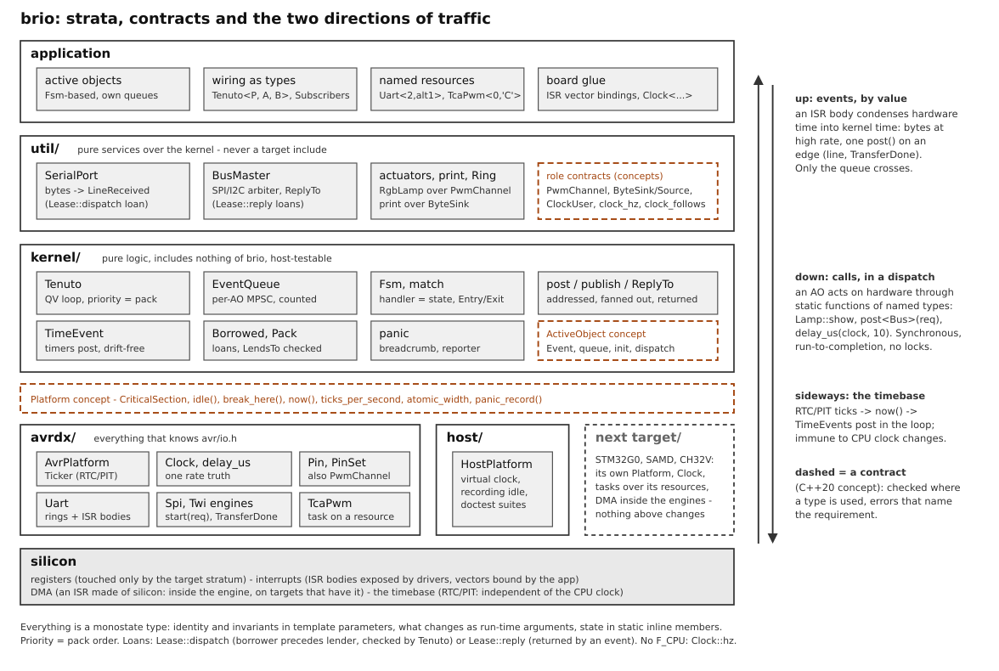

# brio: philosophy, rules, layering

`brio` (from "con brio", the musical marking - deliberately not tied to
any silicon) is a modern-C++ bare-metal framework growing on the
AVR128DB48 testbed, aiming to cover at least the AVR DA/DB families and
to stay portable beyond them. Its core is a QP/QV-style active-object
kernel, written clean-room (concepts from Samek's book, never the QP
source).

[open the diagram full size](https://raw.githubusercontent.com/uliano/brio/main/docs/design/architecture.svg) (zoomable in the browser)

*The strata, the contracts (dashed) and the two directions of
traffic: events up, by value, condensed by ISR bodies; calls down,
inside a dispatch; the timebase sideways, immune to the CPU clock.*

## Governing rule

**Nothing is settled.** Reusing existing code is fine only as long as
it does not limit the design above it: whenever a limitation could be
overcome by rewriting the architecture of what sits below, the rewrite
wins. Every stage of work requires critical analysis at ALL levels of
the stack, not just the layer being added.

## Design pillars

- **Everything resolves at compile time: the monostate type is the
  one idiom.** A peripheral is a singleton by nature (there is one
  SPI0, one PA2), so a TYPE per instance mirrors reality where an
  object would model something that does not exist: `Spi<0>` IS SPI0,
  `Pin<'A', 2>` IS PA2, and its static functions are the access - the
  compiler folds them to the instruction (`SBI`) or the constant
  address. The line that matters: **identity and invariants go in the
  template parameters** (which replica, which route/port, fixed sizes
  and pins - what never changes and should be checked and folded);
  **what changes goes in run-time arguments** (a duty, a byte, a rate;
  also what could be constant but earns no separate type - a baud
  still folds when the argument is a literal); **state lives in
  `static inline` members** (a ring, a queue, the dynamic clock's rate:
  per type, in .bss, no constructor, no init order). Monostate is not
  stateless: the wiring is compile time, the state is static. AOs, the
  Kernel, clocks and tasks over resources are the same sentence. No
  virtual interfaces, no runtime singletons; the empty tag object
  (`constexpr Serial serial;`, `constexpr SysClock clock;`) is how a
  type travels as an argument. The one deliberate return to run time
  is a narrow descriptor a type produces when a request must travel by
  value (`PinRef` from `Pin<>::ref()`), never a parallel abstraction.
- **Drivers move bytes, they do not format.** Text output is
  `brio::print(sink, ...)` - variadic free functions over any ByteSink;
  new types become printable via an ADL `print_one` overload. print
  BLOCKS until the sink accepts: no silent truncation.
- **Protocol layer is push-based.** LineAssembler is fed bytes and
  returns completed lines; no reference to any transport,
  host-testable.
- **One flat namespace `brio`.** Namespaces prevent clashes, they are
  not architecture. Types PascalCase, functions/constants snake_case.
- **Use the freestanding libstdc++** the toolchain ships
  (type_traits, concepts, bit, span, optional, expected - no
  chrono/charconv/iostream) instead of hand-rolled traits.
- **gnu++23** project-wide; C++26 features already in gcc 16 may be
  used when genuinely needed. Idioms in active use:
  `static_assert(false, ...)` in discarded if-constexpr branches for
  "not present on this device" errors, `std::to_underlying` for enum
  codes.

## Generalization rule

Today it is AVR Dx, tomorrow ATSAM C (Cortex-M0+, decided next;
STM32G0x0/x1 also considered for later). No `#ifdef` where a
template/concept boundary can do the job; no AVR includes outside the
platform/driver layer; target-specific facts live behind the Platform
concept or in drivers. The kernel must never know which silicon it
runs on. Family differences inside AVR (DA vs DB, package sizes) are
handled with device-macro guards so the same headers build everywhere.

The preprocessor's one legitimate question is whether a vendor macro
EXISTS - the question no template can ask - and even that is split by
what the answer produces. A probe whose product is a VALUE (a pad's
line number, an instance's clock id, a trigger code, a bonding fact)
belongs in the family's DEVICE-TABLES header (`samc/device_tables.hpp`
is the first), quarantined one entry per header symbol and exported as
plain constexpr data: probes rather than per-variant tables, because a
probe re-reads the vendor header at every compile and cannot drift,
where a copied table can. A driver keeps an `#ifdef` only where it
selects CODE that genuinely differs per instance - a register-struct
reference, an if-constexpr tier - which no constexpr table can hold.
Everything else is C++.

**Authority of util/.** A util type is target-independent by contract
(it includes no target, it is parametrized on a concept, it runs on
the host with a fake) - but its concept was written looking at the
targets that exist, and the authority to call it general is exactly
the list of those targets. Every util type therefore states, in its
header, on which targets it has been validated and which assumption
of theirs its contract may carry (SerialPort: a byte stream with an
RX edge; BusMaster: a transaction that runs on interrupts and
completes later; Ring: an index that fits the platform's atomic
width; AnalogSampler: one result per interrupt with the selected
input readable). With one target, that line is a warning: the second
target is expected to force a synthesis - possibly a rewrite of the
concept - and that is the plan, not a failure: the stability
hierarchy puts util/ below the kernel's ideas for this reason. Two
(nearly) complete low-level strata before generalizing is the right
order; until then, util/ generalizes from one and says so.

## Layering: four strata

Directories under `brio/`; includes always carry the stratum
prefix (`#include "avrdx/usart.hpp"`) so an app's portability is
readable at a glance.

| Stratum | May include | Content |
|---------|-------------|---------|
| `kernel/` | nothing of brio | pure logic: queues, scheduler, FSM, time events, panic, delivery |
| `util/` | `kernel/` | pure services: print, stream concepts, line parser, Ring, SerialPort, SpiBus, timestamp |
| `avrdx/` | `kernel/`, `util/` | everything that knows `avr/io.h`: drivers + AvrPlatform |
| `host/` | `kernel/`, `util/` | the test "target": HostPlatform |

Two targets never meet in one binary, so the second target's stratum
is a sibling of `avrdx/` and the flat namespace stays collision-free.
One library, not one per stratum: discipline comes from this rule,
multi-library would add ceremony without enforcement. Shared
pure types produced by a target and consumed by util live in `util/`
(e.g. `util/timestamp.hpp`).

## Target strata: drivers by role, not a HAL

Pins, timers, PWM, clocks stay files of their target, each with its
own peculiarities stated in the open. brio does not build a HAL and
never a multi-platform one: the common factor between targets is HOW a
driver is made and WHAT it produces upward, not what the peripheral is.

- **A driver is a TASK over a RESOURCE.** Two thin strata: the
  resource handle - `Tcb<0>`, `Tca<1>`, a `Dma<3>` elsewhere - knows
  only that it exists (package check), where its registers are, and
  its identity as a type: no policy, no init; it is the NAME with
  which the app says "this one is mine". The task - `PeriodMeter<
  Tcb<0>, Pin<'A', 2>>`, `TcaPwm<0, 'C'>`, `Ticker` - is named for
  what it does, owns the whole configuration of the peripheral for
  that use, produces events by value upward (`PeriodMeasured{ticks}`)
  and takes commands as static calls. The same resource can enter one
  task at a time; a second task on the same peripheral is another
  type, not a flag. Task names and their events are the same on every
  target; resources and implementations are per target. (Today the
  resource stratum is implicit - `TcaPwm<0, ...>` takes a number; it
  becomes an explicit handle on the second task over the same
  peripheral, generalize on the second specimen.)
- **What is common lives at the role level and is small**: a timebase
  is the Platform's `now()`/`ticks_per_second`; a PWM channel is a
  `PwmChannel` concept (`max` + `duty()`, raw counts, no frequency, no
  polarity - those belong to the timer instance and the target); a
  measurement is an EVENT posted by value with its timestamp. Register
  layouts, modes, clock trees, prescaler sets, event-system wiring are
  never unified: the target speaks its native vocabulary.
- **The brio properties every target driver has**: monostate type
  chosen at compile time, existence and routing checked with
  `static_assert(false)` in the instantiated branch, one `init()` that
  owns the WHOLE configuration of the role (no registers touched by
  halves around the app), ISR handler bodies exposed for the app to
  bind, the model explained in the header comment.
- **No driver allocates a resource the app did not name.** The kernel
  tick runs on the RTC/PIT precisely so that every general-purpose
  timer stays available to the app; a framework that silently takes a
  timer for `millis()` is what brio refuses to be.
- **Interrupts condense, DMA is an ISR made of silicon.** An ISR
  body (exposed by the driver, bound by the app) lives in hardware
  time: the minimum bookkeeping - a byte into a ring, one step of an
  engine - PLUS whatever has a deadline measured in cycles (a counter
  snapshot-and-reset that must land within one heartbeat period, e.g.
  64 CPU cycles at 375 kHz), and, on an EDGE only (a line, a
  transaction done, a window end), one `post()`; the AO above lives
  in kernel time and holds the logic. What has a deadline in cycles
  never goes through the queue; what has a deadline in milliseconds
  always does. Bytes at high rate, events at low rate; only the queue
  crosses. A DMA channel does the ISR's byte-moving without the CPU
  and raises the edge itself: it plugs in INSIDE an engine (`start
  (request)` programs the channel with the request's spans - the
  `Lease::reply` loan made physical - and the completion interrupt
  posts `TransferDone`); nothing above the engine changes, the DMA
  channel is a resource like a timer, and an RX stream fed by DMA is a
  ring whose producer index is the hardware counter. Not on AVR Dx;
  the engine boundary is already where it will go.
- **Hardware routing (event system) is behaviour, not only config.**
  Generators, users and their per-channel legality are TYPES (checked
  at compile time); connecting and disconnecting are run-time
  primitives callable from a state's Entry/Exit - a rewire is an
  action of a state, like arming a time event; a static
  `EventSystem<Route...>` allocating channels at compile time is
  optional sugar over the same primitives. Contention for a channel
  rewired at run time is ownership: it belongs to one AO's FSM. Not
  built; tables grow on demand. The word "event" is overloaded here
  and the overload is kept on purpose (both names belong to others:
  Samek's and the silicon vendors'): a KERNEL event is a value,
  produced, queued and delivered to an active object in its turn - it
  lives in software time; a HARDWARE event is an edge on an internal
  wire from one peripheral to another, no CPU, no datum - it lives in
  hardware time, and becomes a kernel event only through an ISR that
  posts. The types never meet: `Event`/`EventQueue`/`TimeEvent` are
  the kernel's, `EventChannel`/`EvPitDiv`/`EvPin`/... live in the
  target's evsys header, and the kernel knows none of them. In prose,
  "hardware event" / "kernel event" where the context does not tell.
- **PWM is an actuator, not a bus.** Continuous state, set and forget,
  synchronous, no completion, no contention worth an arbiter: rank of
  `Pin`, called from handlers. Fades and sequences are AOs in `util/`
  above the channel, never inside the driver.
- **The clock is a type with two regimes** (full model:
  [clock.md](clock.md)). Compile-time: `Clock<...>`
  owns the tree, `Clock::hz` is the ONE truth the same target's drivers
  derive their divisors from (no vendor `F_CPU`-style macro exists in
  the build: a second truth is unflagged, and vendor headers that need
  it stop compiling on purpose); "always at maximum" is not a rule, a
  low rate is a legitimate choice. Runtime (only when an application needs it): a
  change is a synchronous compile-time fan-out to every clocked driver
  (`Users::rebase(hz)`, applied to all before the next byte - publish
  semantics, fold mechanics, never a queued event that would arrive
  late) coordinated with the bus AOs so nothing changes mid-transfer;
  the RTC-based tick does not move. The kernel never knows the clock.
- **Clock and delay, concretely.** `Clock` is templated on the
  PARAMETERS of the tree (source, multiplier, dividers), never on a
  list of allowed frequencies: `hz` (one per clock domain where the
  target has several) is constexpr ARITHMETIC on those parameters,
  with `static_assert`s carrying the datasheet limits (VCO range, max
  system clock, flash wait states) - the CubeMX-style calculation done
  by the compiler, with errors instead of red boxes. The complexity of
  a rich tree stays inside that target's `clock.hpp`. `Clock::is_static`
  says whether `hz` is a compile-time constant or a runtime value.
  `delay_us<Clock>(us)` ("at least us microseconds") is a per-target
  driver of the short-wait role, for hardware setup times inside
  drivers - never a substitute for time events: a cycle-calibrated loop
  where the core is deterministic (AVR), a hardware counter (DWT
  CYCCNT, SysTick, a free timer, mcycle) where pipelines, prefetch and
  wait states make cycle counting a lottery. Same name and semantics,
  no shared algorithm.
- **Every addition to the AVR stratum is designed with the other
  targets in mind.** Before a new avrdx/ type or a change to one, ask
  what its shape would be on a Cortex-M0+ with a rich clock tree, on
  a RISC-V core, on a chip with per-pin alternate functions instead of
  per-timer routing: the answer decides what goes above the concept
  boundary (little) and what stays in the target file (most). Nothing
  written for AVR may make the second target harder than it already is.
- **Board facts vs device facts.** Which timer reaches which port,
  which USART sits on which pins per route, are facts of the DEVICE
  (today tables inside `tca.hpp`, `usart.hpp` - the seed of a per-family
  header). Which timer drives which LEDs, which pins are buttons, which
  vectors bind to which driver bodies, are facts of the BOARD: they
  belong in a per-board unit that can also list resource claims and
  reject a double use at compile time. Both are built on the second
  target, when there is something to compare.
- **A driver covers its family, not its bench chip.** brio is a
  framework: the target is the whole device range (every instance,
  every mode, every routing option of the chapter's register
  description, both families' errata), not the subset today's app
  exercises. What is knowingly left out is declared in the doc's "Not
  covered yet" - never silently absent. A driver is done only when it
  compiles for EVERY package of the family - a smoke translation unit
  per package, plus negative tests proving that what must be refused
  fails to compile - and its `test_<target>_<subject>` suite passes on
  the bench. The family compile costs seconds and needs no hardware;
  the bench chip alone masks half the family.
- **Package variability, the pattern.** The device header is the
  authority, at three granularities. A missing INSTANCE is compiled
  out in tiers on its header symbol (`#if defined(TCB4)`). An instance
  whose pin POSITION the package does not bond stays fully usable:
  `port_exists` + `if constexpr` compile the missing branch out (a
  run-time `if` on a missing `Pin` kills the whole instance at
  compile time), the compile-time `init<cfg>` refuses the config with
  a static_assert, the run-time `init(cfg)` returns false and
  programs nothing. A missing REGISTER or enum value is gated on its
  header symbol (`EVSYS_SWEVENTB_gm`, `TCA1`). Pin-level bonding
  inside an existing port waits for the device tables. Corollary: a
  fact stated in a doc or header comment ("this LUT has no ALT1")
  either has a guard in the code or is listed as a driver gap -
  knowledge the code does not enforce is a bug deferred.

## Style rulings

- No `Ao` suffix on active-object class names: in an AO framework
  every service is an active object, so the suffix is noise - name
  the class for WHAT it is (`SpiBus`, `SerialPort`, `Blinker`). The
  term stays where it is information: the `ActiveObject` concept and
  the prose.
- Private members: trailing underscore (`head_`), not `m_`.
- Queues speak push/pop.
- No `*_from_isr` API doubling: one always-safe operation, revisit
  only with measurements (see [ring.md](ring.md)).
- No redundant `inline` on in-class definitions.
- `std::optional` returns instead of bool + out-parameter.
- Header comments explain the concurrency model and the WHY of each
  tradeoff - that comment IS the API documentation.
- **Integer widths.** `int` is whatever the target ABI says (16 bits
  on AVR, 32 on the other candidate targets), and the language's
  integer promotions reintroduce it invisibly into every expression -
  so the rules are about DATA and ARITHMETIC, not about banning a
  keyword: (1) every stored or exchanged value - struct fields, event
  payloads, register values, protocol bytes - uses an explicit-size
  type (`uint8_t`, `int16_t`, ...); (2) any arithmetic whose result
  can exceed 16 bits names its width itself: a `UL` suffix on the
  literal, an explicit-width accumulator, or a cast ON AN OPERAND
  (`uint32_t{a} * b` - never on the result, which wraps before the
  cast reaches it). Unsigned wrap is DEFINED behavior: no warning
  level reports it, so only this rule and the host/AVR double-width
  builds stand between a 16-bit product and a silent zero. Plain
  `int`/`auto` stay welcome for ephemeral locals and loop indices,
  where a ban would be noise the promotions bypass anyway. The native
  test build runs under UBSan (`-fsanitize=undefined`, non-recovering)
  so the SIGNED flavors of this mistake fail the test run loudly.
- **Apps never touch registers.** `PORTx.`, `VPORTx.`, peripheral
  structs and vendor bit masks appear only inside the target stratum's
  drivers; an app that needs an operation the driver lacks adds it to
  the driver (`Pin::pullup`, `PinSet::read`), never works around it.
  The only vendor glue an app may contain is the ISR vector binding.
  This does NOT mean the target stratum abstracts every peripheral in
  advance: it grows on demand, one operation or one table row at a
  time, and knob-heavy peripherals (ADC, TCD, CCL) get a `constexpr`
  config struct with designated initializers, not a meaning-abstracting
  API. The rule holds as long as adding to the driver stays easier
  than bypassing it; bench-only probes are declared
  outside it, and what they find goes into a driver afterwards.

## ISR binding pattern

Drivers expose the handler BODY (`rxc()`, `dre()`, `pit()`, `isr()`);
the app binds the vector (`ISR(USART2_RXC_vect) { Serial::rxc(); }`).
Vector names are irreducibly target-specific glue and live in the app,
never in portable code. The bodies are `[[gnu::always_inline]]`: an
ISR body has exactly one call site by construction, so inlining costs
no flash, and with the body visible the compiler saves only the
registers actually used (measured: 16 pushes -> 8/9 per ISR).
